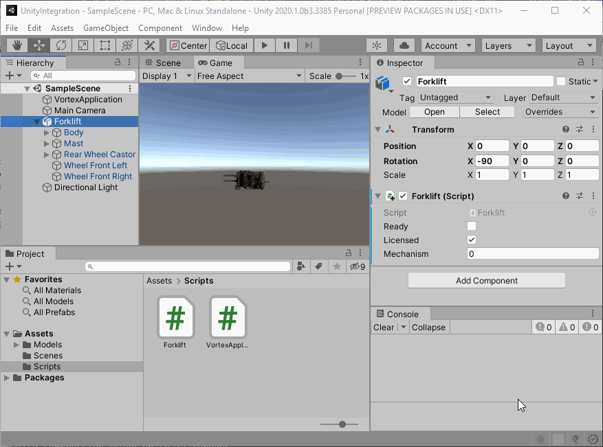

# UnityIntegration

Prototype Unity 3D integration for Vortex Studio.

Usage:
* Requires a valid Vortex Studio license, available for Windows and Ubuntu _(See [Vortex Studio Homepage](https://www.cm-labs.com/vortex-studio/))_
* Install Unity Hub
* Install Unity 2020.1.0
* Install Vortex Studio 2020a _(to default installation path)_
* Install Vortex Studio Content 2020a _(to default installation path)_

Todos:
* Set local rotation and scale _(in Forklift.cs:OnEnable())_
* Set runtime rotation and scale _(in Forklift.cs:FixedUpdate())_
* Use proper axis system conversion in _(in Forklift.cs:OnEnable() & FixedUpdate())_
* Fix the odd and frequent 'stop' crash _(likely from missing cleanup of recently added member(s) variable(s) in Forklift.cs:OnDisable())_

Useful links:
* [Vortex Studio Homepage](https://www.cm-labs.com/vortex-studio/)
* [Vortex Studio Unreal Engine Plugin](https://www.unrealengine.com/marketplace/en-US/product/vortex-studio)
* [Vortex Studio Unreal Engine Documentation](https://www.cm-labs.com/vortexstudiodocumentation/Vortex_User_Documentation/Content/Unreal/unreal_index.htm)

